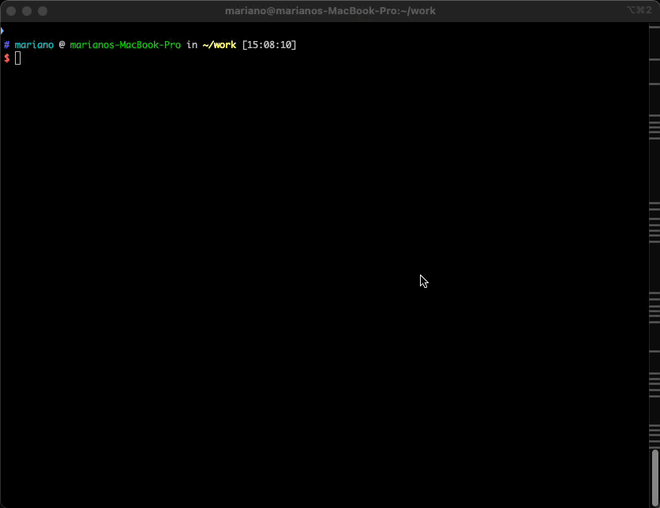

# Enhanced developer experience with Direnv for secrets management

One thing that is usually problematic for every team is addressing the question
of how to provide each developer with environment variables that are sensitive
in a way that is not cumbersome to either set initial values or add new ones
later on.

The setup in this repository is a proposal on how to handle them in a secure way
that is also effective and convenient for Engineers in the team.

https://github.com/mbenedettini/direnv-secrets-management

## Technical details

We'll be using AWS Secrets Manager for this example but it could be easily
adapted to any other secrets management solution: Azure KeyVault, Hashicorp
Vault, GCP Secret Manager.

As with other projects I'm relying on a combination of
[direnv](https://direnv.net/) to pick up a script that performs most tasks
(`.envrc`), and [Nix Flakes](https://nixos.wiki/wiki/Flakes) to install required
packages without polluting the entire OS.

## From Secrets to Env variables

We are assuming all secrets for our project are handled with AWS Secrets Manager
but we don't want all of them to be brought into every local development
environment, therefore only secrets with tag `dev-env=1` will be automatically
pulled into environment variables.

The gist of this is a loop over all secrets that then puts them into
`.envrc-secrets`, which is sourced right away:

```bash
# Fetch secrets and process them with jq
aws secretsmanager list-secrets --filters Key="tag-key",Values="dev-env" Key="tag-value",Values="1" | \
  jq -r '.SecretList[] | .Name' | \
while read secret_name; do
    # Convert secret name to env var name (replace / with _ and uppercase)
    env_var_name=$(echo "$secret_name" | tr '/' '_' | tr '[:lower:]' '[:upper:]')
    
    # Get secret value, extract .password field, and add it to .envrc-secrets
    secret_value=$(aws secretsmanager get-secret-value --secret-id "$secret_name" --query 'SecretString' --output text | jq -r '.password')
    echo "export ${env_var_name}='${secret_value}'" >> .envrc-secrets
done

source_env .envrc-secrets
```

Secret name will be converted into an environment variable name replacing `/`
with `_` and making all letters upercase. For example secret `prod/db0/mariano`
becomes env variable `PROD_DB0_MARIANO`.

All sensitive env variables are then stored into `.envrc-secrets`, which is
included in `.gitignore`.

## AWS cli setup

Some nice defaults have been already provisioned in `config-template` so that a
new hire only has to press enter a few times to go into the AWS SSO
authorization process (we are assumming an AWS account with the right access has
been provisioned for them).

## See it in action

Here's a recording of how it would look for a newcomer to the project:



## What could be improved?

Right now every time the project directory is entered all secrets would get
pulled and `.env-secrets` regenerated, a strategy to perform this only once a
day with a way to manually refresh when necessary would be a nice addition.
