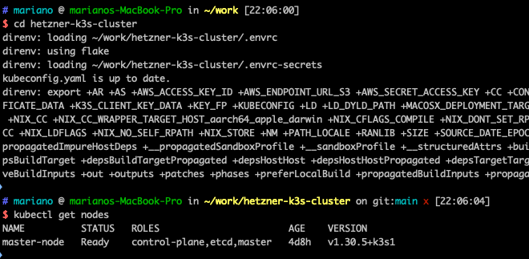
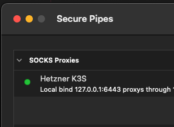
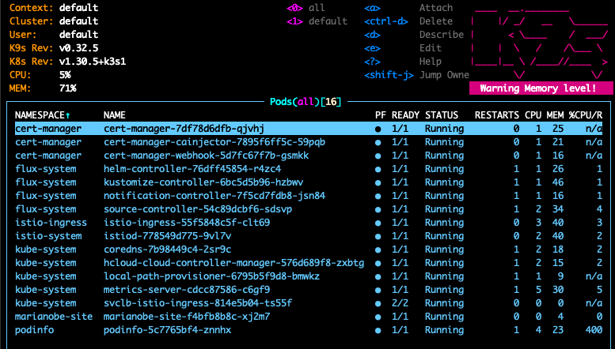

Recently I decided that it was time to have my own personal Kubernetes cluster
as a portfolio to show around how some apps can be deployed and scaled on
inexpensive cloud servers. I went ahead with
[Hetzner Cloud Servers](https://www.hetzner.com/cloud/) given they have a
location in Virginia but OVH would have been a great choice as well.

You can find the code repo for my cluster in
https://github.com/mbenedettini/hetzner-k3s-cluster.

# Developer Experience

For my latest projects I've been successfully using [Nix](https://nixos.org/) to
manage a development shell and build environment and this one wasn't going to be
the exception.

I added [Direnv](https://direnv.net/) to the equation foreasier handling of
environment variables and secrets since that's a key aspect to avoid putting
that burden on the developer.

I ended up with a
[`.envrc`](https://github.com/mbenedettini/hetzner-k3s-cluster/blob/main/.envrc)
file that first loads `flake.nix` to install tools and then sets up a few
things, most notably regenerates the kubectl config file `kubeconfig.yaml` if
any of the certificate data env variables has changed:

```bash title=".envrc"
use flake

generate_kubeconfig() {
  yq eval '
    .clusters[0].cluster."certificate-authority-data" = env(K3S_CERTIFICATE_AUTHORITY_DATA) |
    .users[0].user."client-certificate-data" = env(K3S_CLIENT_CERTIFICATE_DATA) |
    .users[0].user."client-key-data" = env(K3S_CLIENT_KEY_DATA)
  ' kubeconfig-template.yaml > kubeconfig.yaml
  echo "kubeconfig.yaml has been generated."
}

export AWS_ENDPOINT_URL_S3=https://c38e6051dc2ae9ba68ba6144385b3f3e.r2.cloudflarestorage.com/terraform-state-hetzner-k3s-cluster
export KUBECONFIG="${PWD}/kubeconfig.yaml"

if [ -f .envrc-secrets ]; then
    source_env .envrc-secrets
fi

# Check if kubectl.yaml needs to be regenerated
if [ ! -f kubeconfig.yaml ] || \
   [ -f kubeconfig.yaml -a \
     "$(grep -c "$K3S_CERTIFICATE_AUTHORITY_DATA" kubeconfig.yaml 2>/dev/null)" -eq 0 -o \
     "$(grep -c "$K3S_CLIENT_CERTIFICATE_DATA" kubeconfig.yaml 2>/dev/null)" -eq 0 -o \
     "$(grep -c "$K3S_CLIENT_KEY_DATA" kubeconfig.yaml 2>/dev/null)" -eq 0 ]; then
  generate_kubeconfig
else
  echo "kubeconfig.yaml is up to date."
fi
```

Sensitive env variables are stored in a separate file `.envrc-secrets` that for
a large team could be automatically generated based on secrets stored in a
password (1Password) or secrets manager (AWS Secrets Manager).

The important thing is that, provided secrets are available, every team member
has the right environment variables and config files as soon as they cd into the
project root and `kubectl` is ready to be used:



One other important thing to note is that, given the cluster is private, a socks
proxy connection (`ssh -D`) needs to be established. I did it against the master
node itself but a bastion host would have been the right choice.

For these cases I like using
[Secure Pipes](https://www.opoet.com/pyro/index.php) to keep the connection open
at all times:



# Terraform

The first step was setting up a network, subnetwork and a master node using
Terraform under a workspace named staging, having as much code as possible as
modules to that setting up another environment would be easy.

Getting a proper [`cloud-init.yaml`](https://cloud-init.io/) was a bit of a
challenge and I recreated my master node a few times since I wanted the K3S
daemon to only listen on private interfaces (even though firewall can be used to
prevent public access to the Kubernetes API):

```yaml title="master-cloud-init.yaml"
#cloud-config
packages:
  - curl
users:
  - name: cluster
    ssh_authorized_keys: 
      - ${ssh_authorized_key}
    sudo: ALL=(ALL) NOPASSWD:ALL
    shell: /bin/bash
write_files:
  - path: /etc/rancher/k3s/config.yaml
    content: |
      cluster-init: true
      disable-cloud-controller: true
      disable: traefik
      tls-san:
        - 10.0.1.1
      bind-address: 10.0.1.1
      write-kubeconfig-mode: "0644"
      advertise-address: 10.0.1.1
      node-ip: 10.0.1.1

      kubelet-arg:
        - "address=10.0.1.1"
        - "cloud-provider=external"
      flannel-iface: enp7s0

runcmd:
  - curl -sfL https://get.k3s.io | sh -
  - chown cluster:cluster /etc/rancher/k3s/k3s.yaml
  - chown cluster:cluster /var/lib/rancher/k3s/server/node-token
```

The `disable-cloud-controller` line is vital to allow the
[Hetzner Cloud Controller](https://github.com/hetznercloud/hcloud-cloud-controller-manager)
take ownership of the underlying infrastructure and I had to install it before
moving forward with the rest of the process otherwise Nodes and Load Balancer
would not correctly be registered:

```bash
$ helm repo add hcloud https://charts.hetzner.cloud
$ helm repo update hcloud
$ kubectl -n kube-system create secret generic hcloud --from-literal=token=$HCLOUD_TOKEN --from-literal=network=k3s-cluster
$ helm install hccm hcloud/hcloud-cloud-controller-manager -n kube-system -f hccm-values.yaml
WARNING: Kubernetes configuration file is group-readable. This is insecure. Location: /Users/mariano/work/hetzner-k3s-cluster/kubeconfig.yaml
WARNING: Kubernetes configuration file is world-readable. This is insecure. Location: /Users/mariano/work/hetzner-k3s-cluster/kubeconfig.yaml
NAME: hccm
LAST DEPLOYED: Thu Oct 17 13:09:58 2024
NAMESPACE: kube-system
STATUS: deployed
REVISION: 1
TEST SUITE: None
NOTES:
```

Right after the helm chart was installed pods that were in pending state were
successfully scheduled.

# FluxCD

Once the Master node was ready I was able to bootstrap FluxCD the usual way:

```bash
$ flux bootstrap github \
  --token-auth \
  --owner=mbenedettini \
  --repository=hetzner-k3s-cluster \
  --branch=main \
  --path=clusters/staging \
  --personal
```

Just to check everything was good:

```bash
$ flux get kustomizations -A
NAMESPACE  	NAME             	REVISION          	SUSPENDED	READY	MESSAGE
flux-system	apps             	main@sha1:948b01dd	False    	True 	Applied revision: main@sha1:948b01dd
flux-system	flux-system      	main@sha1:948b01dd	False    	True 	Applied revision: main@sha1:948b01dd
flux-system	secrets          	main@sha1:948b01dd	False    	True 	Applied revision: main@sha1:948b01dd
```

I then added [Istio](https://istio.io/) to the cluster using FluxCD and
[Cert-Manager](https://cert-manager.io/) shortly after (you can check config for
both in the repo under
[infrastructure](https://github.com/mbenedettini/hetzner-k3s-cluster/tree/main/infrastructure)).

Cert-Manager didn't work out of the box because I am using a selector different
from the default one so I had to set `meshConfig.ingressClass` and
`meshconfig.ingressSelector` to the right values so that Istio would correctly
pick up the right K8S Gateway that cert manager creates to route the
`/.well-known/acme-challenge` traffic to the solver service and pod.

# Custom Apps and their Deployment

A nice set up that worked in past projects is having a separate Github workflow
for each app that needs to be deployed.

So for example
[this very same site](https://github.com/mbenedettini/hetzner-k3s-cluster/tree/main/apps/staging/marianobe-site)
is now hosted on this Cluster and deployed by FluxCD from the
[`deploy-marianobe-site`](https://github.com/mbenedettini/hetzner-k3s-cluster/blob/main/.github/workflows/deploy-marianobe-site.yaml)
workflow that is triggered from the blog repo in the
[`build-push-deploy`](https://github.com/mbenedettini/blog/blob/master/.github/workflows/docker-build-push-deploy.yml#L38)
job, using an action that dispatches workflows from another repository.

Every time I commit or merge a PR into master the site gets automatically built
and deployed.

Due to Github security restrictions a Token with the right permissions (r/w to
the Cluster repo) is needed in both repos, the origin (to trigger the deploy
action on the cluster repo) and the target one (to push the commit containing
the image sha change).

# Next steps and considerations

Some things that I have in mind:

1. Add Worker nodes to the cluster, defined by Terraform but with count=0
   leaving Autoscaler the task of deciding how many are needed.

   Things look good but a bit tight at the moment:

   

2. Move apps to the worker nodes, leaving only control plane on the master.
3. Add an Airbyte/Dagster pipeline to show how their tasks can be orchestrated
   in an inexpensive cluster.
4. Add FluxCD Notifications controller, likely integrating with Slack.
